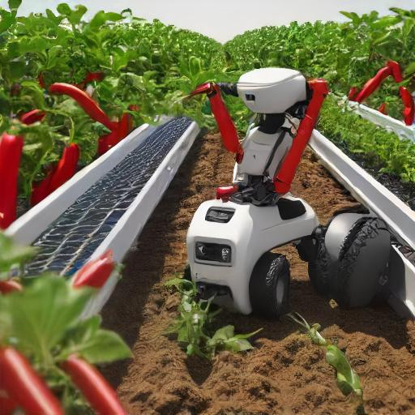

# A Hybrid State-Space Model of Individual Dairy Cows

> **Robot harvester: works perfect**\
> Me Myself, Some Supervisor, Some Other Person
> Paper: https://todo.nl

## About
Official implementation of the paper 'Robot harvester: perfect harvesting of fruits'. This software is perfect in harvesting fruits. 

## Installation
Describe here how to install your software (if relevant). Which Python version does it require? Which dependencies do you have to install, e.g.:

This model is tested on Matlab R2022b

## Usage
Describe how to run your code, e.g.:

To start training on your custom dataset:
```
python3 train.py <<path_to_custom_dataset>>
```

## Citation
```
<<ADD CITATION IN BIBTEX FORMAT>>
```

## Funding
The Synergia project is organized and led by Wageningen University and Research in close cooperation with Next Food Collective as well as the Universities of Delft, Twente, Eindhoven, and Nijmegen. The authors have declared that no competing interests exist in the writing of this publication. Funding for this research was obtained from the Netherlands Organisation for Scientific Research (NWO grant 17626), IMEC-One Planet and other private parties.
