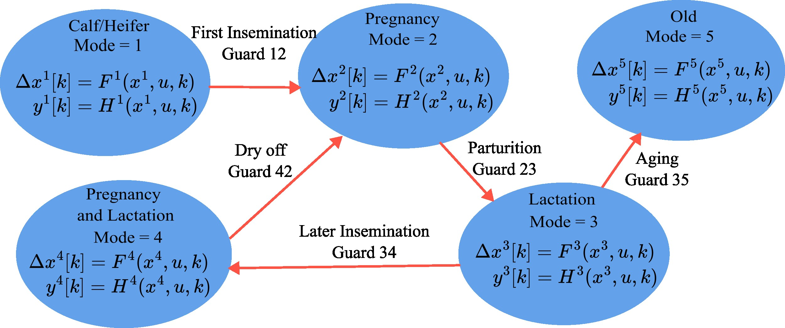

# A Hybrid State-Space Model of Individual Dairy Cows
>**The code will be made publicly available upon publication of the paper, expected by September.**


> **Figure: Architecture of the hybrid state-space model for individualized dairy cow feeding**\
> Maedeh Sadeghi, Sjoerd Boersma, Jan Dijkstra, Simon van Mourik, Peter Groot Koerkamp, and Eldert van Henten

# About
Official implementation of the paper *From Herd-Level to Individualized Control: A Hybrid State-Space Model for Feeding Individual Dairy Cows*.

This model is designed to predict individual cow responses—such as milk yield, methane emissions, and body weight changes—to varying feed intake levels.

## Installation
This model is tested on Matlab R2022b
<!-- 
## Citation
```
<<ADD CITATION IN BIBTEX FORMAT>>
```
-->

## Funding
The Synergia project is organized and led by Wageningen University and Research in close cooperation with Next Food Collective as well as the Universities of Delft, Twente, Eindhoven, and Nijmegen. The authors have declared that no competing interests exist in the writing of this publication. Funding for this research was obtained from the Netherlands Organisation for Scientific Research (NWO grant 17626), IMEC-One Planet and other private parties.
